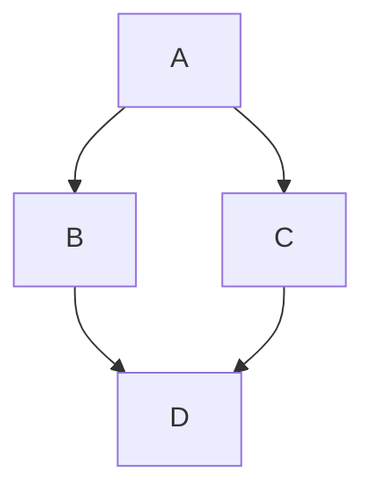

# Heading Styles

# Heading 1
## Heading 2
### Heading 3
#### Heading 4
##### Heading 5
###### Heading 6

---
## Lorem Ipsum
Eu incididunt exercitation voluptate irure aute. In in mollit adipisicing duis. Aliqua aliqua ut eu id.

Duis exercitation laboris amet amet tempor anim ex. Lorem ut incididunt aliquip eu irure. Commodo sint labore ipsum pariatur officia magna enim aute ad quis. Ullamco est exercitation ipsum culpa aliquip Lorem fugiat ad nostrud. Ea et enim consequat et quis consequat minim.

Ipsum quis officia ut amet dolor velit fugiat tempor nostrud occaecat duis eiusmod. Irure id nulla velit ipsum. Minim fugiat exercitation deserunt minim.

## Text Formatting

**Bold Text**

*Italic Text*

***Bold and Italic***

~~Strikethrough~~

> Blockquote example

`Inline code`

```
Code Block Example
```

```bash
# Code block with syntax highlighting
echo "Hello, World!"
```

```json
{
  "key": "value",
  "number": 123
}
```

---

## Lists

### Unordered List

- Item 1
- Item 2
  - Sub-item 1
  - Sub-item 2

### Ordered List

1. First item
2. Second item
   1. Sub-item 1
   2. Sub-item 2

### Nested Mixed List

- Item 1
  1. Sub-item A
  2. Sub-item B
- Item 2
  - Sub-item X
  - Sub-item Y

---

## Links & Images

[Hugo Website](https://gohugo.io/)


---

## Tables

| Column 1 | Column 2 | Column 3 |
|----------|----------|----------|
| Data 1   | Data 2   | Data 3   |
| Data 4   | Data 5   | Data 6   |
| **Bold** | *Italic* | `Code`   |

---

## Task List

- [x] Task 1
- [ ] Task 2
- [ ] Task 3

---

## Footnotes

Here is a sentence with a footnote.[^1]

[^1]: This is the footnote explanation.

---

## Definition List

Term 1
: Definition 1

Term 2
: Definition 2

---

## Horizontal Rules

---

***

___

---

## Emojis

🚀 💡 🔥 🎉 😃

---

## HTML in Markdown

<div style="color: red; font-weight: bold;">This is HTML inside Markdown!</div>

---

## Escaping Characters

\*This is not italic\*

\# Not a heading

---

## Subscript & Superscript

H~2~O (Subscript)

X^2^ (Superscript)

---

## Automatic Links

<https://gohugo.io/>

---

## Abbreviations

Markdown converts HTML, CSS, and JS into web pages.

*[HTML]: HyperText Markup Language
*[CSS]: Cascading Style Sheets
*[JS]: JavaScript

---

## Custom Containers (Hugo-specific but works in Markdown)

::: warning
This is a warning box!
:::

::: info
This is an info box!
:::

---

## Math Equations (LaTeX / MathJax)

### Inline Math

Euler's formula: $e^{i\pi} + 1 = 0$

Pythagorean theorem: $a^2 + b^2 = c^2$

### Block Math

$$
\int_{a}^{b} x^2 \,dx = \frac{b^3}{3} - \frac{a^3}{3}
$$

$$
F(x) = \sum_{n=0}^{\infty} \frac{f^{(n)}(a)}{n!} (x - a)^n
$$

Quadratic formula:

$$
x = \frac{-b \pm \sqrt{b^2 - 4ac}}{2a}
$$

---

## Underlined Text (Using HTML)

<u>Underlined Text</u>

---

## Keyboard Shortcuts

Press `Ctrl` + `C` to copy.

---

## Spoiler (HTML workaround)

<details>
  <summary>Click to reveal</summary>
  Hidden content here!
</details>

---

## ASCII Art

```
  /\_/\  
 ( o.o ) 
 > ^_^ < 
```

---

## Mermaid Diagrams (If enabled in Hugo)



---

## Sound Embed (HTML workaround)

<audio controls>
  <source src="sound.mp3" type="audio/mpeg">
  Your browser does not support the audio tag.
</audio>

---

## Video Embed (HTML workaround)

<video width="320" height="240" controls>
  <source src="video.mp4" type="video/mp4">
  Your browser does not support the video tag.
</video>