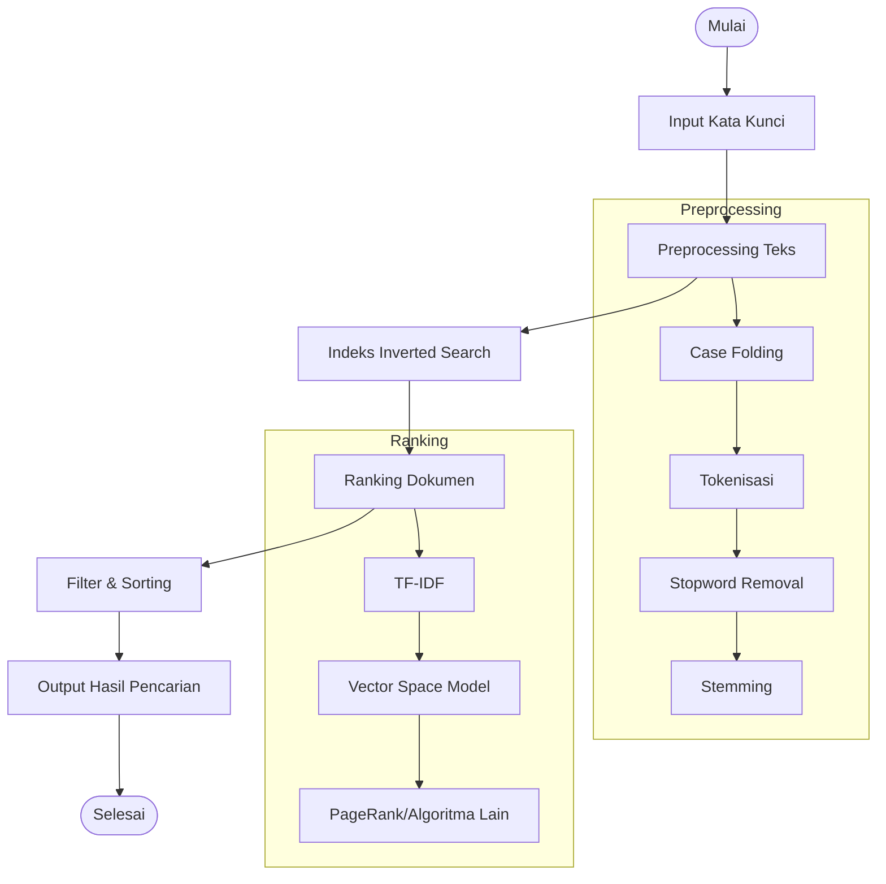

## ✍️ Hello Notes

# Heading 1
## Heading 2
### Heading 3
#### Heading 4
##### Heading 5
###### Heading 6

Ini adalah paragraf contoh. Markdown memungkinkan kita untuk menulis teks dengan format sederhana.

**Teks Tebal**  
*Tulisan Miring*  
~~Coret~~

> Ini adalah blockquote. Bisa digunakan untuk kutipan atau highlight informasi.

---

### Daftar Tidak Berurut
- Item pertama
- Item kedua
  - Sub-item pertama
  - Sub-item kedua
- Item ketiga

### Daftar Berurut
1. Langkah pertama
2. Langkah kedua
   1. Sub-langkah pertama
   2. Sub-langkah kedua
3. Langkah ketiga

---

### Kode Program
```python
def hello():
    print("Hello, world!")
hello()
```

---

### Tabel
| Nama  | Umur | Kota      |
|-------|------|----------|
| Ali   | 25   | Jakarta  |
| Budi  | 30   | Bandung  |
| Siti  | 27   | Surabaya |

---

### Gambar


---

### Link
[Kunjungi Hugo](https://gohugo.io)
# Matematika (KaTeX / MathJax)

Berikut adalah contoh perhitungan matematika kompleks dalam bentuk MathJax:

$$
\int_{0}^{\infty} \frac{x^{3}}{e^{x}-1}\,dx = \frac{\pi^{4}}{15}
$$

**Penjelasan:**
Ini adalah integral yang terkait dengan fungsi Bose-Einstein dan menghasilkan solusi eksak \\(\frac{\pi^{4}}{15}\\). Perhitungan ini melibatkan:

1. Ekspansi deret:
$$
\frac{1}{e^{x}-1} = \sum_{n=1}^{\infty} e^{-nx}
$$

2. Substitusi dan integral parsial:
$$
\int_{0}^{\infty} x^{3} e^{-nx}\,dx = \frac{6}{n^{4}}
$$

3. Penjumlahan deret Riemann zeta:
$$
\sum_{n=1}^{\infty} \frac{1}{n^{4}} = \zeta(4) = \frac{\pi^{4}}{90}
$$

4. Gabungkan hasil:
$$
6 \cdot \frac{\pi^{4}}{90} = \frac{\pi^{4}}{15}
$$

---

# Diagram (Mermaid)



---

## GoAT diagrams (ASCII)
```goat
                   +---------------------+
                   |   Crawling Module   |
                   +----------+----------+
                              |
                              v
+---------------------+       +---------------------+       +---------------------+
|    URL Frontier     | <---> |   Web Crawler       | ----> |   Raw HTML Data     |
+---------------------+       +---------------------+       +---------------------+
                              |
                              v
                   +---------------------+
                   |   Parser/Indexer    |
                   +----------+----------+
                              |
                              v
+---------------------+       +---------------------+       +---------------------+
|   Inverted Index   | <----> |  Tokenizer/         | <---- |   Processed Text    |
|   (Database)       |        |  Stemmer            |       |   (Keywords, Meta)  |
+---------------------+       +---------------------+       +---------------------+
                              |
                              v
                   +---------------------+
                   |   Ranking Algorithm |
                   |  (PageRank, TF-IDF) |
                   +----------+----------+
                              |
                              v
                   +---------------------+
                   |   Query Processor   |
                   +----------+----------+
                              |
                              v
                   +---------------------+
                   |   Search Results    |
                   |   (Ranked List)     |
                   +---------------------+
```

```goat
+------+     +------+     +------+
| User |     | API  |     | DB   |
+--+---+     +--+---+     +--+---+
   |            |            |
   |-- Request->|            |
   |            |-- Query -->|
   |            |<-- Data ---|
   |<-- Response|            |
```